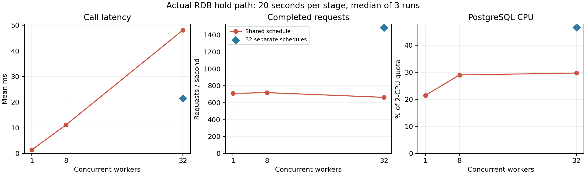

# RDB 비관적 잠금 경합·DB 부하 실측 — 2026-10-09 KST

현재 develop 기준 `7d12af2c6b79d9bbf7d5b3cd50c90f43cac4a07d`의 `JdbcReservationStore`를 수정 없이 실행하고 테스트 코드에서 SQL·pool·PostgreSQL 대기·컨테이너 CPU를 계측했다. 과거 운영 환경의 원본 실험을 복원한 것은 아니다. RDB 비교 구현은 좌석별이 아닌 **회차별 행 잠금**으로 쓰기를 직렬화한다.

## 확인된 결론

같은 회차에서 worker를 1→32개로 늘리자 평균 응답은 **1.407→48.156ms (34.2배)**, 잠금 SELECT 실행 구간 평균은 **0.137→46.075ms**로 늘었다. 처리량은 **710.3→663.3 요청/초 (0.93배)**에 머물렀다. 32 worker의 평균 락 대기 세션은 30.474개, 관측 최대는 31개였다. active 세션 표본 중 Lock 대기 비중은 98.06%였다.

PostgreSQL CPU는 2 CPU quota 대비 **21.49→29.73%**였다. 사용량은 증가했으나 CPU 90% 포화는 재현하지 않았다. 32 worker를 서로 다른 회차로 분산하면 처리량 **1488.3 요청/초**, Lock 대기 표본 비중 **0.04%**였다. 잠금 공유를 없애면 처리량이 약 2.24배 증가하므로, 이번 환경의 핵심 병목은 공유 회차 행의 락 경합으로 해석할 수 있다. 모든 CPU/백분위는 3회 지표의 중앙값이며 CPU는 평균 사용량의 중앙값이다.

## 측정 조건과 도구

- 전용 PostgreSQL 17.11 컨테이너, 제한 2 CPU/2 GiB, port 25432, DB lock_metrics. 기존 app/comparison 데이터와 분리.
- 이미지 digest: postgres@sha256:b0f9560a2de083e2cc7382e75f808c7381a32852a7ec49117deedb300e552b24.
- Temurin JDK 21.0.12.1, JUnit 5, Java ExecutorService/CountDownLatch, JDBC 동적 proxy, System.nanoTime.
- READ COMMITTED, SELECT FOR UPDATE, 기본 fsync/synchronous_commit=on.
- 모든 단계에서 load pool 32개, 별도 observer pool 1개. pool 부족으로 동시성을 제한하지 않았다.
- 단계별 closed-loop 20초, 5조건 × 3회 = 15단계. 500건 JVM/JDBC 워밍업, 단계별 fixture 초기화, 2회차 역순 실행.
- 독립 좌석/독립 사용자로 4매 제한과 중복 거절을 제외한 경합을 먼저 측정했다. 같은 좌석 조건은 성공/정상 거절을 따로 집계했다.
- 인위적인 잠금 유지 시간이나 pg_sleep을 넣지 않았다.
- pg_stat_activity의 wait_event_type='Lock' 및 pg_blocking_pids를 약 20ms 주기로 조회하고 원본 세션 수를 저장했다. 실제 주기는 부하에 따라 길어졌다.
- Docker exec로 PostgreSQL cgroup cpu.stat usage_usec를 약 1초 간격과 시작/종료에 읽었다. DB 프로세스 전체 사용량이며 observer SQL 및 백그라운드 작업도 포함한다.
- 테스트 generator와 DB가 공유하는 상위 실행 환경은 2 CPU/8 GiB quota다. 개별 서비스 전용 머신/운영 HTTP 환경의 수치가 아니다.

## 3회 측정 지표 중앙값

평균/백분위는 각 단계의 저장소 호출 구간이다. 잠금 SELECT 시간은 JDBC 실행·네트워크·DB 처리·락 대기를 포함하므로 순수 락 대기 시간으로 표현하지 않는다.

| 조건 | worker | 요청/초 | 평균 응답 ms | p95 ms | 잠금 SELECT 평균 ms | 대기 세션 평균 / 관측 최대 | active 표본 중 Lock 대기 | DB CPU(2코어 한도 대비) |
| --- | ---: | ---: | ---: | ---: | ---: | ---: | ---: | ---: |
| 동일 회차·독립 좌석 | 1 | 710.3 | 1.407 | 2.778 | 0.137 | 0.000 / 0 | 0.00% | 21.49% |
| 동일 회차·독립 좌석 | 8 | 718.7 | 11.127 | 19.533 | 9.253 | 6.550 / 7 | 91.51% | 29.01% |
| 동일 회차·독립 좌석 | 32 | 663.3 | 48.156 | 74.785 | 46.075 | 30.474 / 31 | 98.06% | 29.73% |
| 회차 분산·독립 좌석 | 32 | 1488.3 | 21.485 | 55.708 | 2.830 | 0.006 / 7 | 0.04% | 46.57% |
| 동일 좌석 경합 | 32 | 708.5 | 45.090 | 74.736 | 43.163 | 30.478 / 32 | 98.11% | 28.53% |

같은 회차 32 worker의 pool 확보 평균은 0.012ms다. 요청 지연 대부분이 pool 확보가 아니라 FOR UPDATE 실행 구간에 있었다. Lock 표본 비율은 요청 중 대기를 경험한 비율이나 락 발생 횟수가 아니며, 순간 관측의 backend 세션 수로 계산했다.

CPU의 1코어=100% 방식에서는 동일 회차 1 worker 42.98%, 32 worker 59.46%다. 위 표는 이를 2로 나눈 quota 대비 비율이다. 1코어 기준 수치를 CPU 전체 포화율로 쓰지 않는다. 같은 좌석 조건의 처리량에는 정상 거절이 포함된다.

## 테스트 판정과 한계

- 총 요청 256,783건, HELD 214,395건, 정상 충돌 42,388건. SQL 오류/timeout/수량 제한은 모두 0건.
- 15단계의 독립 좌석 성공/DB 행 수, 같은 좌석 성공 1건 및 소유자 존재, 요청별 lock SQL·pool 계측 수를 모두 검사했다. JUnit 1건 안의 모든 단계가 PASS이며 failures/errors/skipped=0이다.
- 원본 timing 분포로 평균·p95를 재계산하고 원본 대기 샘플의 평균/최대를 재집계하여 CSV와 일치함을 확인했다.
- DB 선점/거절 동작의 검증이며 활성 예약 생성·결제 확정은 범위 밖이다. 기존 TC-19/20 결함이 해결됐다고 보고하지 않는다.
- observer와 proxy의 비용, JVM·공유 CPU·20초 단계 길이·테이블 증가 효과를 포함한다. 고정 유입 500/2000 TPS나 운영 CPU 90% 결과로 일반화하지 않는다.

## 프로젝트 설명 권장 문구

> 비관적 락과 트랜잭션을 사용하는 RDB 선점 방식을 검증한 결과, 같은 회차의 동시 요청을 1개에서 32개로 늘리면 평균 응답이 1.41ms에서 48.16ms로 증가하고 최대 31개 세션이 락을 대기했습니다. 반면 처리량은 약 710~663 요청/초에 머물러 회차 행 잠금의 경합을 확인했습니다.

‘기존 운영 구현에 적용했지만 CPU가 90%였다’는 과거 이력은 원본 커밋·부하/관측 자료가 별도로 필요하다. 이번 수치는 현재 비교 구현의 재현 실험 근거로 작성한다.

## 코드·재현·증거

- [계측 테스트 코드](../../../storage-comparison/src/test/java/com/example/fairline/comparison/RdbLockContentionTest.java).
- [실행 안내](../../../storage-comparison/LOCK-CONTENTION.md).
- [원본 전체 결과](2026-10-09-rdb-lock-metrics/).
- [15단계 원본 CSV](2026-10-09-rdb-lock-metrics/measurements/results.csv), [중앙값 CSV](2026-10-09-rdb-lock-metrics/median.csv), [JUnit HTML](2026-10-09-rdb-lock-metrics/html/index.html), [실행 로그](2026-10-09-rdb-lock-metrics/execution.txt).
- smoke의 2초 결과는 별도로 보관하고 본 측정 20초 중앙값에 섞지 않았다. smoke 이후 CPU 샘플 종료 위치를 보정해 monitor join의 idle 구간을 제외했다.

```bash
# 저장소 루트에서 JDK 21로 실행
docker compose -f storage-comparison/compose-lock-metrics.yaml up -d --wait
bash gradlew :storage-comparison:rdbLockContention --no-daemon --max-workers=2 --console=plain
```

## 시각화



pg_stat_activity는 변화 중인 세션을 관측하므로 대기 세션 수/최대와 표본 비율은 관측치다. 같은 좌석 조건에서 모든 worker가 대기로 보인 표본이 있어도 전역 잠금 상태의 원자적 스냅샷이나 정확한 대기 이벤트 수로 해석하지 않는다.

관련 작업: [이슈 #28](https://github.com/l-wanderer01/FairLine-Ticket/issues/28).
